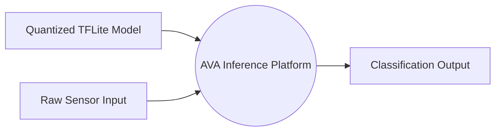
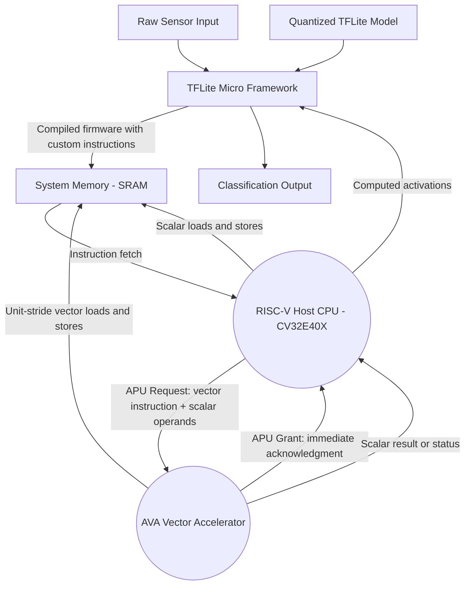
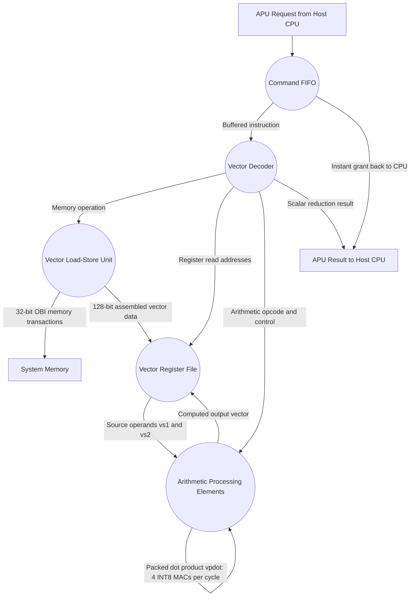
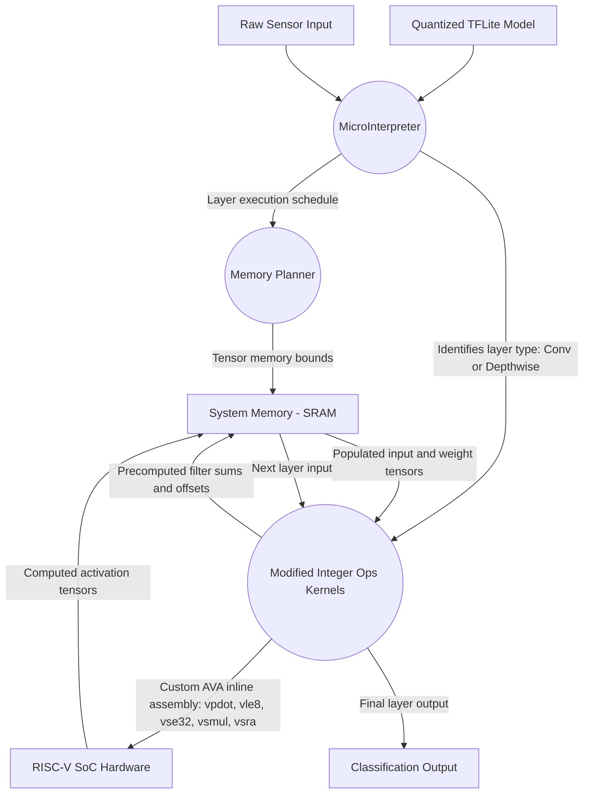

# AVA Project — Data Flow Diagrams

---

## Level 0 DFD — System Context

The entire AVA platform is one process. Only external inputs and outputs are shown.

### Explanation

- **Quantized TFLite Model** — The pre-trained neural network containing the graph structure, INT8 weights, biases, and quantization parameters. Generated offline, does not change at runtime.
- **Raw Sensor Input** — The live data being classified. For VWW, this is a 96x96 grayscale image array.
- **AVA Inference Platform** — The complete system: software framework, host CPU, and vector accelerator working together.
- **Classification Output** — The softmax probability vector printed to UART, e.g. `[0.039, 0.961]` indicating 96.1% confidence a person is present.

---

## Level 1 DFD — Expanding the Hardware SoC

Opens the SoC to show the Host CPU and AVA Accelerator as separate processes sharing system memory.

### Explanation

- **TFLM** compiles firmware containing custom vector instructions and populates SRAM with model weights and input tensors.
- **Host CPU** fetches instructions from SRAM. Scalar work (loops, pointers, control flow) runs on the CPU. When it hits a custom OP-V instruction, it forwards it to the AVA Accelerator via the APU interface.
- **AVA Accelerator** receives vector instructions and executes them independently. It has its own direct SRAM connection for vector loads/stores, bypassing the CPU entirely. The internal Command FIFO releases the CPU immediately, enabling parallel scalar + vector execution.
- **System Memory** is shared 256 KB SRAM holding firmware, weights, inputs, and intermediate activations.

---

## Level 1.1 DFD — Expanding the AVA Vector Accelerator

Zooms into the AVA Accelerator RTL pipeline — from instruction reception to computation and writeback.

### Explanation

1. **Command FIFO** — Captures incoming instructions and immediately acknowledges the CPU. 4-deep buffer enables fire-and-forget dispatch, decoupling CPU from accelerator latency.
2. **Vector Decoder** — Extracts opcode, register addresses, and control signals. Routes to VLSU (memory ops), Register File (addresses), or PEs (arithmetic).
3. **Vector Load-Store Unit** — Generates 32-bit OBI transactions to fetch/store data from SRAM. Assembles responses into 128-bit vectors for the register file.
4. **Vector Register File** — 32 registers × 128 bits. Two read ports, one write port. All data flows through here.
5. **Arithmetic PEs** — Four 32-bit PEs in parallel. Key modifications:
   - **Zero-Skipping** — skips multiply when operand is zero; compacts entire cycle if all four PEs see zero.
   - **Packed Dot Product vpdot** — 4× INT8 MACs per PE per cycle.
   - **Fused ReLU/Requantization** — activation and quantization in same pipeline stage, no extra instructions needed.
6. **Result Return** — Vector results stay in register file; scalar reductions route back to CPU via decoder.

---

## Level 2 DFD — Expanding the TFLite Micro Framework

Zooms into the software side — how TFLM orchestrates model execution and emits custom AVA instructions.

### Explanation

1. **MicroInterpreter** — Parses the `.tflite` model, identifies the 28-layer graph (14 conv + 14 depthwise), and schedules execution order.
2. **Memory Planner** — Allocates and shares SRAM for intermediate tensors to minimize memory footprint.
3. **Modified Integer Ops Kernels** — The C++ functions in `conv.h` and `depthwise_conv.h` where our software modifications live:
   - **Precomputed filter sums** — eliminates redundant additions from inner loops.
   - **Hoisted vsetvli** — vector config runs once outside the loop, not every iteration.
   - **Custom inline assembly** — inner loops replaced with AVA instructions (`vpdot.vv`, `vle8.v`, `vsmul.vv`, `vsra.vv`, `vse32.v`).
   - **Vectorized requantization** — entire output channel vectors requantized simultaneously instead of scalar per-element.
4. **System Memory** — Data exchange medium: kernels read inputs/weights, SoC writes computed activations back for the next layer.

