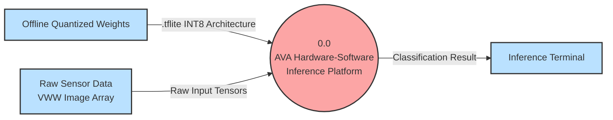
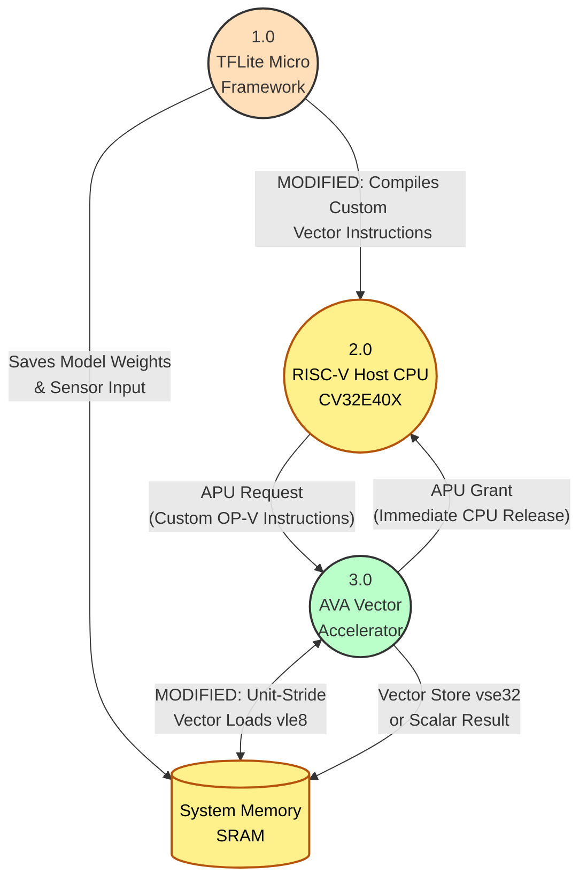
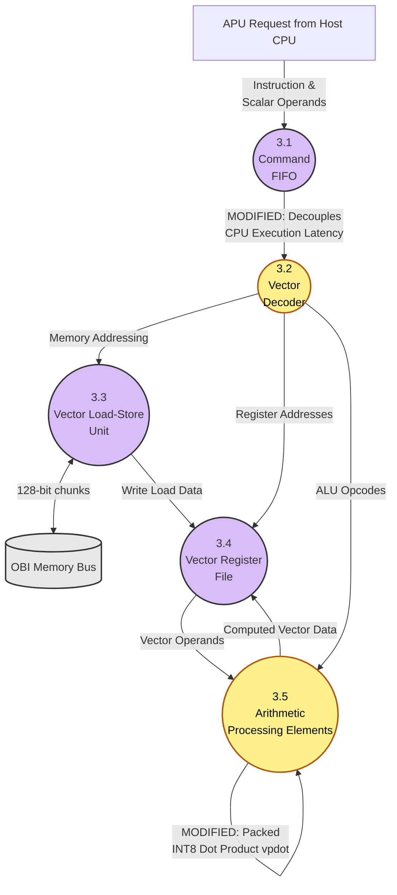

# AVA Project Data Flow Diagrams (Revised)

These Data Flow Diagrams (DFDs) map the exact technical flow of data through the system, specifically highlighting the architectural modifications and custom instructions added for this project.

---

## 1. Level 0 DFD (System Boundaries)
This diagram defines the absolute boundaries of the inference system.

---

## 2. Level 1 DFD (Software vs. Hardware Partitioning)
This diagram opens the system to show how the high-level software interacts with the physical System-on-Chip (SoC). It completely abstracts TFLM's internal parsing and focuses strictly on what the software *delivers* to the hardware.

I have highlighted our **Custom Project Modifications** in yellow.

**Key Takeaways:** 
*   **TFLM (1.0)** acts simply as the orchestrator to populate `System Memory` and compile our `Custom Vector Instructions`.
*   **The CV32E40X Host CPU (2.0)** issues these instructions using the APU interface.
*   **The AVA Accelerator (3.0)** receives the requests and independently pulls data from `System Memory` using efficient Unit-Stride memory access rules.

---

## 3. Level 2 DFD (Inside the AVA Accelerator RTL)
This diagram is completely zoomed in on Process `3.0` (The AVA Accelerator). It traces the cycle-by-cycle journey of data through the RTL pipeline.

I have strictly highlighted our **Custom Project Modifications** in yellow to emphasize the hardware improvements.

**Key Takeaways (The Data Flow):**
1.  Instructions arrive from the Host CPU into the **Command FIFO** (`3.1`), immediately decoupling the CPU from waiting.
2.  The **Decoder** (`3.2`) parses the instruction. If it's a memory instruction, it triggers the **VLSU** (`3.3`) to pull massive 128-bit chunks from the OBI Bus into the **Register File** (`3.4`).
3.  If it's an arithmetic instruction, the **Register File** feeds the data vectors into the **Arithmetic PEs** (`3.5`).
4.  Inside the PEs, our modifications take over: data is compacted via **Zero-Skipping**, squeezed through **Packed Dot Products (`vpdot`)**, and piped entirely through **Hardware Requantization & ReLU** before flowing back into the Register File.
