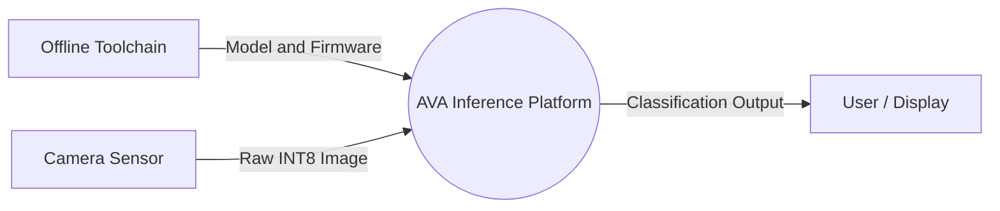
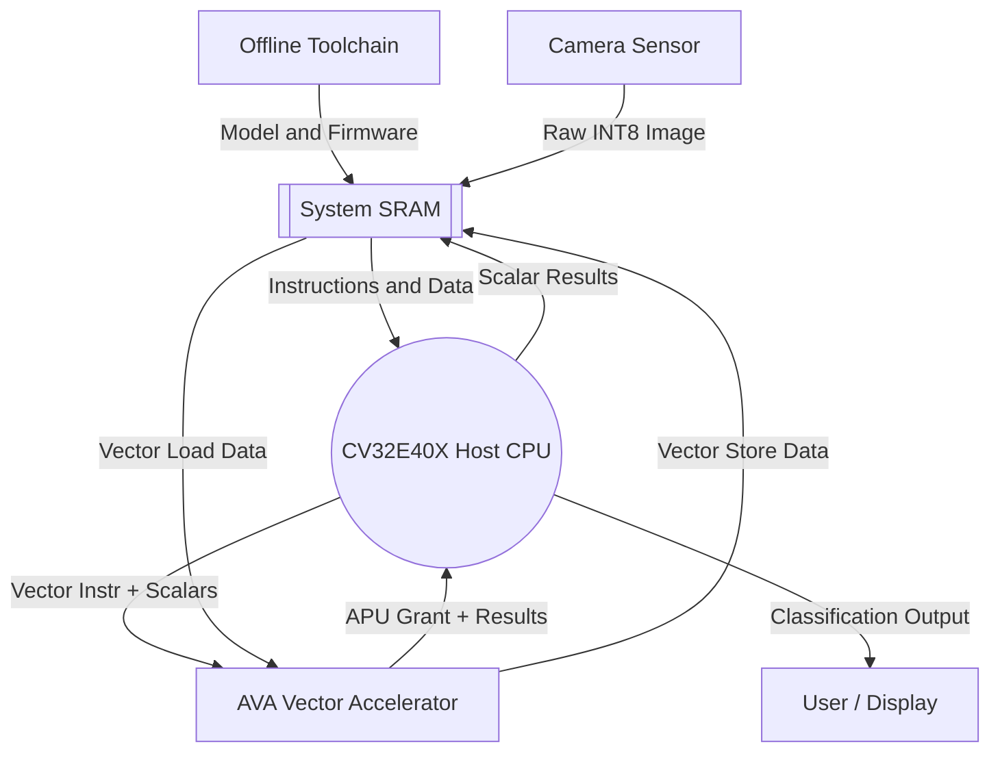
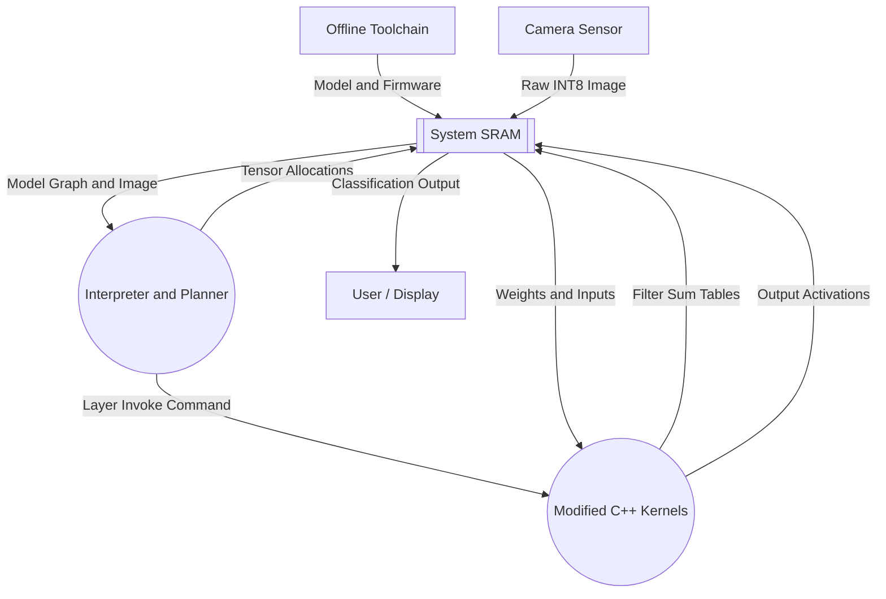
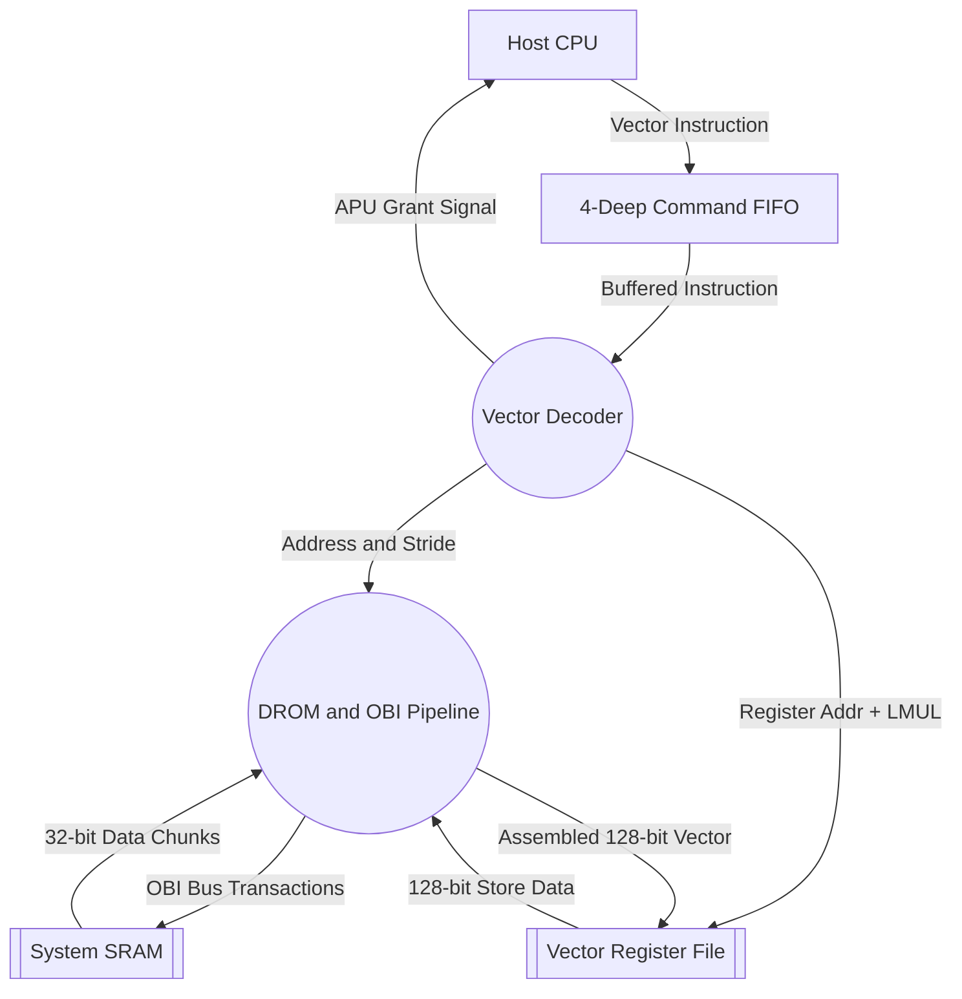
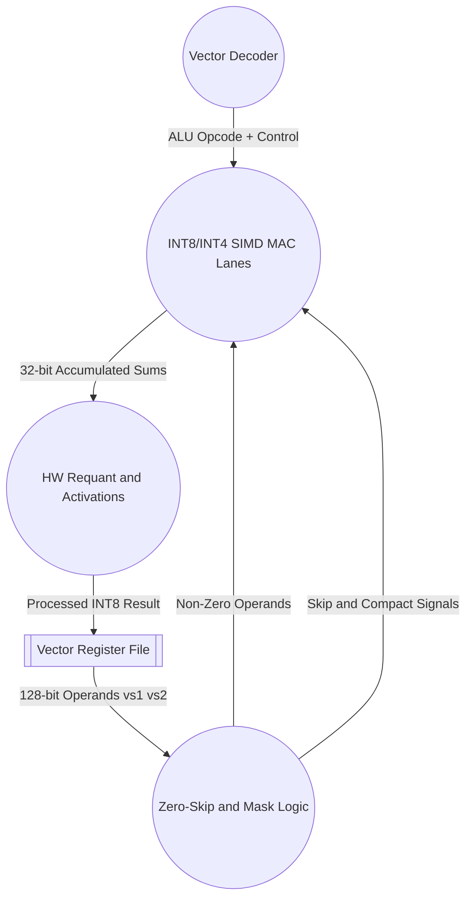

# AVA Project — Simplified Data Flow Diagrams

> **DFD Notation:**
> - **Rectangles `[...]`** — External entities and subsystems
> - **Double-line `[[...]]`** — Data stores
> - **Circles `((...))` ** — Processing functions
> - **Arrows** — Data flow

---

## Diagram 1 — Level 0: System Context

The entire AVA platform as a single process.

### Explanation

- **Offline Toolchain** — Host PC where TensorFlow quantizes the model and GCC cross-compiles the firmware. Happens before runtime.
- **Camera Sensor** — Provides the live 96x96 INT8 input image at runtime.
- **AVA Inference Platform** — The single process being expanded in Level 1 (hardware view) and Level 2 (software view).
- **User / Display** — Receives the final softmax probability output.

---

## Diagram 2 — Level 1: Hardware SoC Data Flow

Expands the **((AVA Inference Platform))** process from Level 0 into its hardware components. All external entities from Level 0 are carried forward.

### Explanation

- **Offline Toolchain** and **Camera Sensor** — Same external entities from Level 0. Their data lands in **System SRAM**: firmware binaries and model weights are pre-loaded, and the raw image is written into the tensor arena.
- **System SRAM** — Shared 256KB holding firmware code, model weights, input tensors, and activations.
- **CV32E40X Host CPU** — Fetches instructions, runs scalar work. Forwards custom vector opcodes to AVA via the APU bus. Sends final classification result to User.
- **AVA Vector Accelerator** — Executes vector instructions independently with its own direct OBI bus to SRAM. Expanded in Level 1.1 and Level 1.2.
- **User / Display** — Same external entity from Level 0. Receives the final output from the CPU.

---

## Diagram 3 — Level 2: Software Execution Data Flow

Also expands the **((AVA Inference Platform))** process from Level 0, but from the software perspective. All external entities from Level 0 are carried forward, and their landing point (SRAM) is consistent with Level 1.

### Explanation

- **Offline Toolchain** and **Camera Sensor** — Same external entities from Level 0. Their data lands in **System SRAM** (consistent with Level 1): firmware/model are pre-loaded, image is written into the tensor arena.
- **Interpreter and Planner** — Reads the model graph and image from SRAM. Memory Planner pre-allocates tensor pointers. Interpreter schedules the 28-layer execution and invokes kernels layer by layer.
- **Modified C++ Kernels** (`conv.h`, `depthwise_conv.h`) — Software modifications:
   - Precomputed filter sums hoisted out of inner loops.
   - Hoisted `vsetvli` — vector config runs once outside the loop.
   - Inner loop math replaced with inline assembly (`vle8`, `vpdot`, `vsmul`, `vsra`, `vse32`).
   - Vectorized requantization — entire output channels processed simultaneously.
- **System SRAM** — Central data store. Receives external inputs, feeds the Interpreter, exchanges data with Kernels (weights/inputs in, filter sums/activations out). After all 28 layers, the final classification result is read from SRAM to User.
- **User / Display** — Same external entity from Level 0. Receives the final output from SRAM.

---

## Diagram 4 — Level 1.1: AVA Instruction Fetch and Memory Pipeline

Expands the **[AVA Vector Accelerator]** subsystem from Level 1. External entities from Level 1 (Host CPU and SRAM) are carried forward.

### Explanation

- **Host CPU** and **System SRAM** — Carried forward from Level 1 as the external entities connected to AVA.
- **4-Deep Command FIFO** (`vector_fifo.sv`) — Buffers up to 4 incoming instructions and instantly grants the CPU, so the CPU never stalls.
- **Vector Decoder** (`vector_decoder.sv`) — Extracts opcode, register addresses, control signals. Routes to memory pipeline (DROM) or arithmetic pipeline (Level 1.2). Applies LMUL to group registers.
- **DROM and OBI Pipeline** (`vector_lsu.sv`) — Two Phase 2 optimizations:
   - **EARTH-Style DROM** — Coalesces up to 4 strided INT8 loads into 1 maximized 32-bit OBI transaction (75% latency reduction).
   - **OBI Double-Buffering** — Overlaps address of N+1 with data of N, eliminating dead wait cycles.
- **Vector Register File** (`vector_registers.sv`) — 32 registers × 128 bits. Receives loaded vectors from DROM, supplies operands to the arithmetic pipeline.

---

## Diagram 5 — Level 1.2: AVA Arithmetic and Post-Processing Pipeline

Also expands the **[AVA Vector Accelerator]** subsystem from Level 1. The Vector Decoder and Vector Register File from Level 1.1 are carried forward as context.

### Explanation

- **Vector Decoder** and **Vector Register File** — Carried forward from Level 1.1 as shared entities.
- **Zero-Skip and Mask Logic** (`arith_stage.sv`) — Checks each operand byte. If weight or activation is zero, asserts `skip_mac`. If all 4 PEs see zero, asserts `compact_cycle` to skip the entire cycle. Also applies vector mask predicates.
- **INT8/INT4 SIMD MAC Lanes** (`pe_32b.sv`, `processing_element.sv`):
   - **vpdot (INT8)** — 4 separate 8-bit multipliers per PE, 4 MACs per cycle.
   - **vpdot4 (INT4)** — 8 separate 4-bit multipliers per PE, 8 MACs per cycle.
- **HW Requant and Activations** (`relu_bound.sv`, `sat_unit.sv`, `mapping_unit.sv`):
   - **Requantization** — Shift + saturate 32-bit accumulator to INT8 in hardware.
   - **ReLU / Leaky ReLU / Abs Clamp** — Combinational logic, zero extra cycles.
   - **256-entry HW LUTs** — Sigmoid and Tanh computed in a single clock tick.
