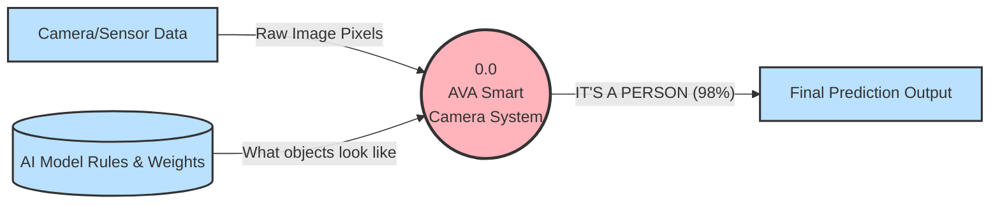

# Simplified AVA Project Data Flow Diagrams 

These simplified Data Flow Diagrams (DFDs) explain the core concepts of the AI Vector Accelerator (AVA) without relying on heavy engineering jargon. They focus purely on *how information moves* from the real world into the hardware.

---

## 1. Level 0 DFD (The Big Picture)
This diagram shows the entire system from a bird's-eye view. Data goes in, predictions come out.



**What it means:** The "System" is a black box. It takes raw pictures from a camera and offline rules about what a person looks like (the AI Model), processes them together, and outputs a simple text prediction to the user.

---

## 2. Level 1 DFD (Software vs. Hardware)
Let's open the black box. How does the software talk to the physical chips?

```mermaid
flowchart TD
    %% Styles
    classDef external fill:#bae1ff,stroke:#333,stroke-width:2px;
    classDef processSoftware fill:#ffdfba,stroke:#333,stroke-width:3px,shape:circle;
    classDef processHardware fill:#baffc9,stroke:#333,stroke-width:3px,shape:circle;
    classDef datastore fill:#e8e8e8,stroke:#333,stroke-width:2px,shape:cylinder;

    %% Elements
    InputData[Images & AI Rules]:::external
    SystemMemory[(System Memory)]:::datastore
    Result[Prediction Output]:::external

    %% Processes
    Software((1.0 \n Software Brain \n (TensorFlow Lite))):::processSoftware
    Hardware((2.0 \n Physical Brain \n (AVA Hardware Core))):::processHardware

    %% Data Flows
    InputData -- "Raw Data" --> Software
    Software -- "Saves data for hardware" --> SystemMemory
    
    Software -- "1. Please calculate this specific math problem" --> Hardware
    Hardware -- "2. I am doing it, don't wait for me" --> Software
    
    Hardware -- "Fetches the saved data" <--> SystemMemory
    Hardware -- "3. Here is the final math answer" --> Software
    
    Software -- "Final Answer" --> Result
```

**What it means:** The Software prepares all the images and math rules, saving them in the `System Memory`. It then issues simple command requests to the Hardware chip. The Hardware chip uses its own special connections to pull that data from `System Memory`, does the heavy math by itself, and simply alerts the Software when the answer is ready. 

---

## 3. Level 2 DFD (Inside the Hardware Chip)
Now let's crack open the Physical Brain (`2.0`) to see the assembly line that makes the AVA chip so fast.

```mermaid
flowchart TD
    %% Styles
    classDef external fill:#bae1ff,stroke:#333,stroke-width:2px;
    classDef process fill:#d8bdf8,stroke:#333,stroke-width:3px,shape:circle;
    classDef datastore fill:#e8e8e8,stroke:#333,stroke-width:2px,shape:cylinder;

    %% Elements
    SoftwareHost[Main Software]:::external
    SystemMemory[(System Memory)]:::datastore
    
    %% Internal Hardware Processes
    Inbox((2.1 \n Command Inbox \n (FIFO))):::process
    Translator((2.2 \n Command \n Translator))):::process
    Storage((2.3 \n Temporary \n Shelves))):::process
    MathWorkers((2.4 \n Math Workers \n (Processing Elements))):::process
    MemoryFetcher((2.5 \n Direct Memory \n Fetcher))):::process

    %% Data Flows
    SoftwareHost -- "Math Command" --> Inbox
    Inbox -- "Acknowledged" --> SoftwareHost
    
    Inbox -- "Next Command" --> Translator
    Translator -- "What to fetch" --> MemoryFetcher
    Translator -- "What to calculate" --> MathWorkers
    
    MemoryFetcher -- "Fetch huge blocks of data" <--> SystemMemory
    MemoryFetcher -- "Put data on shelves" --> Storage
    
    Storage -- "Give data to workers" --> MathWorkers
    MathWorkers -- "Skip Zeroes! Instantly finish" --> MathWorkers
    MathWorkers -- "Put finished answers back on shelves" --> Storage
    
    Translator -- "Alert when calculation is fully done" --> SoftwareHost
```

**What it means:** 
1. The Software sends a command to the **Inbox**, which immediately accepts it so the software isn't stuck waiting.
2. The **Translator** reads the command and acts like a manager. It tells the **Memory Fetcher** to grab data from the main computer memory and place it on the **Temporary Shelves** (Vector Registers) inside the chip.
3. The **Translator** then tells the **Math Workers** to grab that data from the shelves.
4. The **Math Workers** efficiently compute the result (ignoring any data that is "Zero" to save time) and put the final answer *back* on the shelves.
5. The **Translator** notifies the Main Software that the assembly line is finished.
